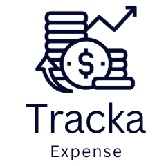

<div align="center">
  
  
  # TrackaExpense
  
  ### 💰 Your Smart Personal Finance Companion
  
  [](https://reactnative.dev/)
  [](https://firebase.google.com/)
  [](LICENSE)
  [](package.json)
  
  **A comprehensive, ad-free personal finance app built with React Native and Firebase**
  
  [Download APK](https://trackaexpense.dhruvchheda.com) • [Report Bug](https://github.com/chhedadhruv/TrackaExpense/issues) • [Request Feature](https://github.com/chhedadhruv/TrackaExpense/issues)
  
</div>

---

## 📱 About TrackaExpense

TrackaExpense is a modern, feature-rich expense tracking application designed to help you take control of your finances. With an intuitive interface, powerful analytics, and seamless cloud synchronization, managing your money has never been easier.

### ✨ Why TrackaExpense?

- **🚀 100% Ad-Free** - Pure financial tracking experience
- **🔒 Secure & Private** - Your data is encrypted and protected
- **☁️ Cloud Sync** - Access your data from anywhere
- **📊 Smart Analytics** - Visual insights into your spending patterns
- **👥 Bill Splitting** - Split expenses with friends and groups
- **🎯 Savings Goals** - Track and achieve your financial goals
- **📸 Receipt Management** - Capture and store receipts
- **🔔 Smart Reminders** - Never miss tracking your expenses

---

## ✨ Features

### 🏠 **Dashboard**
- **Real-time Overview** - View total expenses, income, and balance at a glance
- **Recent Transactions** - Quick access to your latest financial activities
- **Time Range Filters** - View data for 7 days, 30 days, 3 months, 6 months, 1 year, or all time
- **Quick Actions** - Fast access to add income or expense

### 📊 **Statistics & Analytics**
- **Interactive Charts** - Beautiful bar charts and pie charts
- **Category Breakdown** - See spending by category with visual representations
- **Trend Analysis** - Track income and expense patterns over time
- **Custom Date Ranges** - Analyze specific time periods
- **Export Data** - Share and backup your financial reports

### 💵 **Transaction Management**
- **Quick Entry** - Add income or expenses in seconds
- **Rich Categories** - Organize with pre-defined or custom categories
- **Receipt Capture** - Take photos or upload receipt images
- **Transaction Details** - Add notes, amounts, dates, and categories
- **Edit & Delete** - Full control over your transaction history
- **Search & Filter** - Easily find specific transactions

### 🎯 **Savings Goals**
- **Goal Setting** - Create multiple savings goals with target amounts
- **Progress Tracking** - Visual progress bars showing achievement
- **Deposit & Withdraw** - Manage your savings with ease
- **Goal History** - Track all changes to your savings
- **Multiple Goals** - Manage various savings objectives simultaneously

### 👥 **Bill Splitting**
- **Group Management** - Create groups for different occasions
- **Split Methods** - Split equally or by custom percentages
- **Expense Tracking** - Keep track of who paid what
- **Settlement System** - Easy settlement between group members
- **Smart Calculations** - Automatic calculation of who owes whom
- **Group Notifications** - Stay updated on group activities
- **Split History** - View all past splits and settlements

### 🔔 **Smart Notifications**
- **Daily Reminders** - Gentle nudges to track your expenses
- **Fun Messages** - Motivational and engaging notification messages
- **Split Alerts** - Get notified about group activities and settlements
- **Customizable** - Control notification preferences
- **Context-Aware** - Smart notifications based on your activity

### 👤 **Profile & Settings**
- **Profile Management** - Update your name, email, and profile picture
- **Authentication Options**:
  - Email/Password sign-in
  - Google Sign-In integration
  - Apple Sign-In (iOS only)
- **Account Security** - Phone verification and secure authentication
- **Privacy Policy** - Transparent data handling information
- **Contact Support** - Easy access to customer support
- **Account Deletion** - Full control with instant account deletion

### 📸 **Receipt Management**
- **Photo Capture** - Take pictures directly from the app
- **Gallery Upload** - Select existing photos from your device
- **Image Storage** - Securely stored in Firebase Storage
- **Receipt Viewing** - Full-screen receipt viewing
- **Receipt Sharing** - Share receipts when needed

---

## 🛠️ Technologies Used

### **Core Framework**
- **React Native 0.76.5** - Cross-platform mobile development
- **TypeScript** - Type-safe development
- **React 18.3.1** - Latest React features

### **Backend & Cloud**
- **Firebase Authentication** - Secure user authentication
- **Firebase Firestore** - Real-time NoSQL database
- **Firebase Storage** - Secure file storage
- **Firebase Cloud Messaging** - Push notifications

### **Authentication**
- **Google Sign-In** - Seamless Google authentication
- **Apple Sign-In** - Native iOS authentication
- **Email/Password** - Traditional authentication method

### **UI & Design**
- **React Native Paper** - Material Design components
- **React Native Vector Icons** - Beautiful icon library
- **React Native Linear Gradient** - Smooth gradient effects
- **Custom Fonts** - Kufam & Lato typography

### **Navigation**
- **React Navigation 7** - Smooth screen transitions
- **Stack Navigator** - Modal and card-style navigation
- **Bottom Tab Navigator** - Easy access to main features

### **Data Visualization**
- **React Native Gifted Charts** - Beautiful, customizable charts
- **Bar Charts** - For trend analysis
- **Pie Charts** - For category breakdowns

### **Notifications**
- **Notifee** - Advanced local notifications
- **Firebase Cloud Messaging** - Remote push notifications
- **Smart Scheduling** - Context-aware reminders

### **Additional Libraries**
- **Moment.js** - Powerful date manipulation
- **React Native Image Picker** - Photo selection and camera
- **React Native Share** - Native sharing capabilities
- **React Native Async Storage** - Local data persistence
- **React Native Onboarding Swiper** - Beautiful onboarding experience

---

## 📦 Installation

### Prerequisites

Before you begin, ensure you have the following installed:
- **Node.js** (>= 18.0.0)
- **npm** or **yarn**
- **React Native CLI**
- **Android Studio** (for Android development)
- **Xcode** (for iOS development, macOS only)
- **JDK 17** (for Android)

### Step 1: Clone the Repository

```bash
git clone https://github.com/chhedadhruv/TrackaExpense.git
cd TrackaExpense
```

### Step 2: Install Dependencies

```bash
npm install
# or
yarn install
```

### Step 3: Environment Configuration

#### 3.1 Create Environment File

```bash
cp env.example .env
```

#### 3.2 Configure Google Sign-In

Edit the `.env` file with your Google Web Client ID:

```env
# Google Sign-In Configuration
GOOGLE_WEB_CLIENT_ID=your-actual-web-client-id.apps.googleusercontent.com
GOOGLE_IOS_CLIENT_ID=your-ios-client-id.apps.googleusercontent.com
GOOGLE_OFFLINE_ACCESS=false
GOOGLE_FORCE_CODE_FOR_REFRESH_TOKEN=false
GOOGLE_ACCOUNT_NAME=
GOOGLE_PROFILE_IMAGE_SIZE=120
GOOGLE_OPENID_REALM=
GOOGLE_SERVICE_PLIST_PATH=
GOOGLE_HOSTED_DOMAIN=
```

**To get your Google Web Client ID:**
1. Go to [Google Cloud Console](https://console.cloud.google.com/)
2. Select your project (or create a new one)
3. Navigate to **"APIs & Services"** > **"Credentials"**
4. Find your **"Web application"** client (not Android/iOS client)
5. Copy the **Client ID** and paste it in your `.env` file

### Step 4: Firebase Configuration

#### 4.1 Android Configuration

1. Download `google-services.json` from your Firebase Console
2. Place it in `android/app/google-services.json`
3. Ensure your SHA-1 fingerprint is added to Firebase:

```bash
cd android
./gradlew signingReport
```

Copy the SHA-1 and add it to Firebase Console under Project Settings > Your Apps > Android App

#### 4.2 iOS Configuration

1. Download `GoogleService-Info.plist` from your Firebase Console
2. Place it in `ios/GoogleService-Info.plist`
3. Open `ios/TrackaExpense.xcworkspace` in Xcode
4. Add the plist file to the project

#### 4.3 Install iOS Pods

```bash
cd ios
pod install
cd ..
```

### Step 5: Run the Application

#### Android

```bash
npm run android
# or
npx react-native run-android
```

For release build:
```bash
npm run android:release
```

#### iOS

```bash
npm run ios
# or
npx react-native run-ios
```

For release build:
```bash
npm run ios:release
```

### Step 6: Start Metro Bundler

If not started automatically:

```bash
npm start
# or
yarn start
```

To reset cache:
```bash
npm run start:reset
```

---

## 🔧 Build for Production

### Android APK

```bash
npm run build:android
```

The APK will be generated at:
```
android/app/build/outputs/apk/release/app-release.apk
```

### Android App Bundle (for Play Store)

```bash
npm run build:android:bundle
```

The AAB will be generated at:
```
android/app/build/outputs/bundle/release/app-release.aab
```

### iOS IPA

1. Open `ios/TrackaExpense.xcworkspace` in Xcode
2. Select **Product** > **Archive**
3. Follow the app distribution wizard

---

## 🔐 Privacy & Security

TrackaExpense takes your privacy seriously:

- **End-to-End Encryption** - All data transmission is encrypted
- **Secure Authentication** - Firebase Auth with OAuth 2.0
- **No Data Selling** - We never sell your personal information
- **Account Deletion** - Instant account and data deletion
- **Privacy Policy** - Full transparency in data handling
- **GDPR Compliant** - Respects your data rights

For detailed information, see our [Privacy Policy](screens/PrivacyPolicyScreen.js).

---

## 📝 Available Scripts

| Command | Description |
|---------|-------------|
| `npm start` | Start Metro bundler |
| `npm run android` | Run on Android device/emulator |
| `npm run ios` | Run on iOS device/simulator |
| `npm run android:release` | Run Android in release mode |
| `npm run ios:release` | Run iOS in release mode |
| `npm run build:android` | Build Android APK |
| `npm run build:android:bundle` | Build Android App Bundle |
| `npm run build:clean` | Clean Android build |
| `npm run start:reset` | Start Metro with cache reset |
| `npm run lint` | Run ESLint |
| `npm test` | Run Jest tests |

---

## 🐛 Known Issues

- Apple Sign-In is only available on iOS devices
- Some notification features may require proper Firebase configuration
- Receipt images require camera/storage permissions

---

## 📄 License

This project is licensed under the **MIT License** - see the [LICENSE](LICENSE) file for details.

---

## 🙏 Acknowledgements

- [React Native](https://reactnative.dev/) - The amazing framework
- [Firebase](https://firebase.google.com/) - Backend infrastructure
- [React Navigation](https://reactnavigation.org/) - Navigation solution
- [React Native Paper](https://callstack.github.io/react-native-paper/) - UI components
- [Notifee](https://notifee.app/) - Local notifications
- [React Native Gifted Charts](https://gifted-charts.web.app/) - Beautiful charts
- [Google Sign-In](https://developers.google.com/identity) - Authentication
- [Apple Sign-In](https://developer.apple.com/sign-in-with-apple/) - iOS authentication

---

## 📧 Contact & Support

**Dhruv Chheda**

- 🌐 Website: [dhruvchheda.com](https://dhruvchheda.com)
- 📧 Email: me@dhruvchheda.com
- 🐙 GitHub: [@chhedadhruv](https://github.com/chhedadhruv)
- 💼 LinkedIn: [Dhruv Chheda](https://linkedin.com/in/dhruvchheda)

---

## ⭐ Show Your Support

If you find TrackaExpense helpful, please consider:
- ⭐ Starring this repository
- 🐛 Reporting bugs
- 💡 Suggesting new features
- 🔀 Contributing to the code
- 📢 Sharing with friends

---

<div align="center">
  <p>Made with ❤️ by <a href="https://dhruvchheda.com">Dhruv Chheda</a></p>
  <p>© 2025 TrackaExpense. All rights reserved.</p>
</div>
